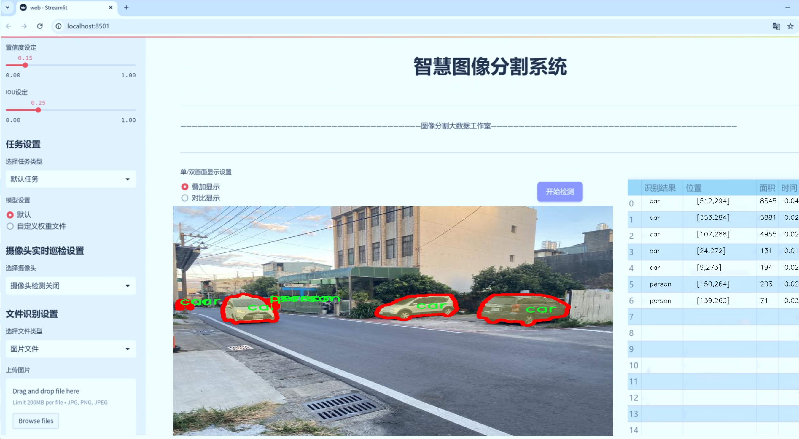
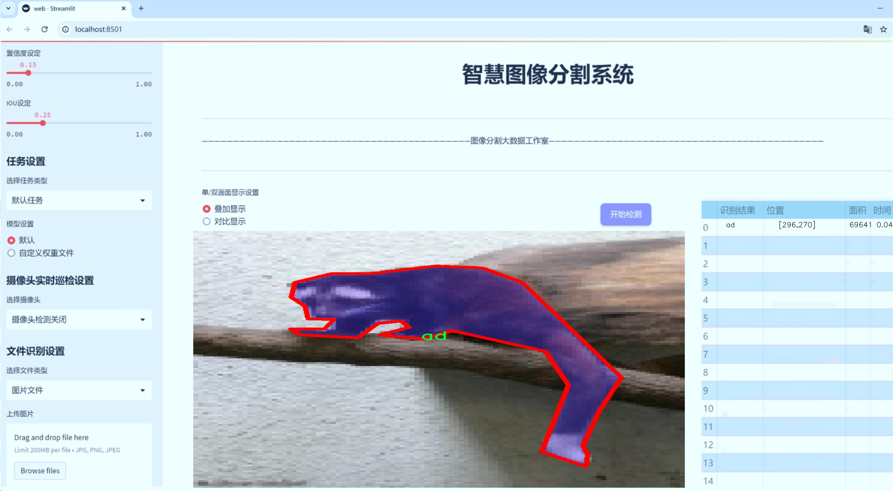
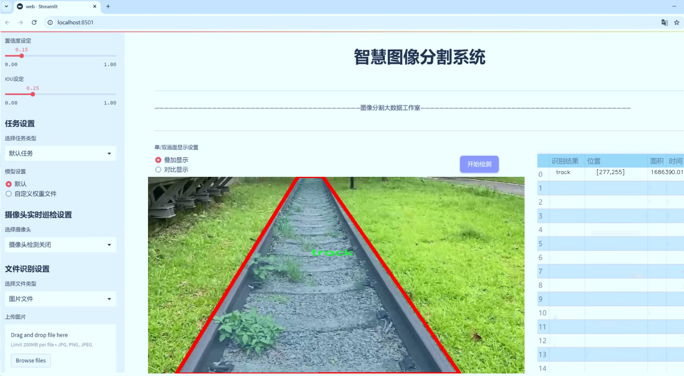
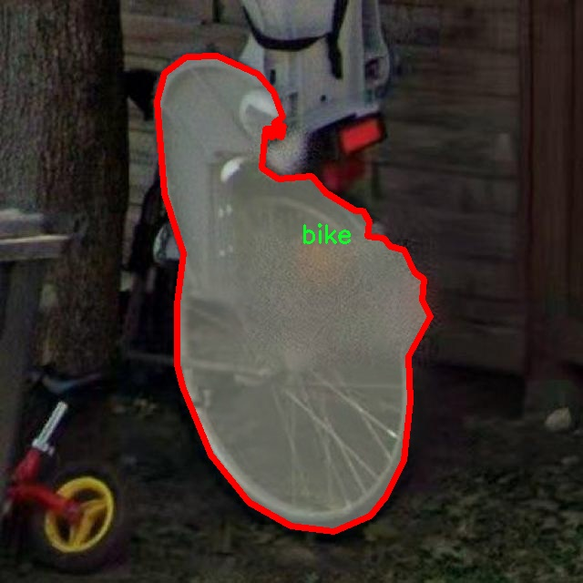
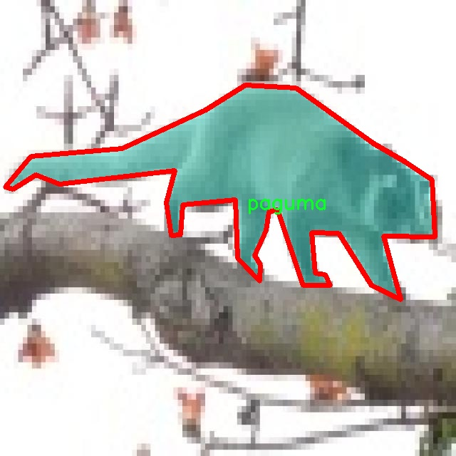
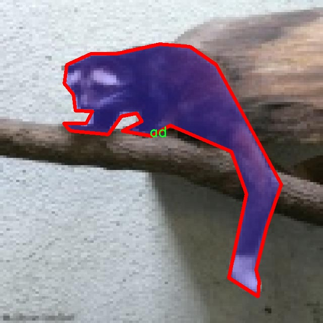
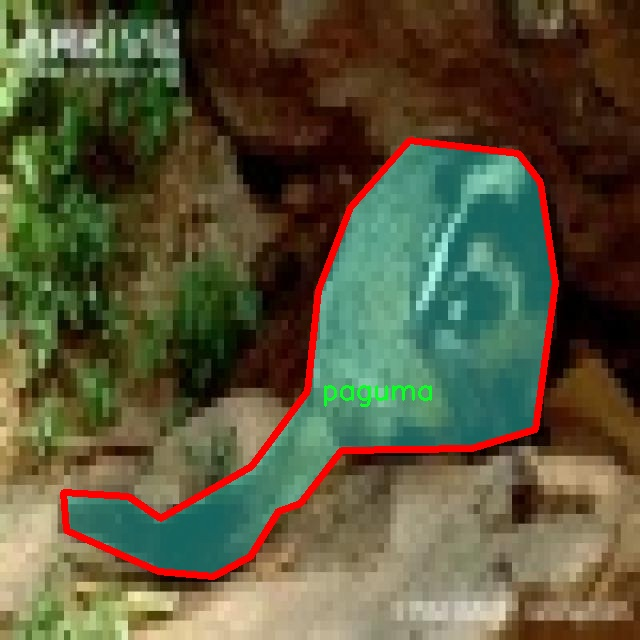
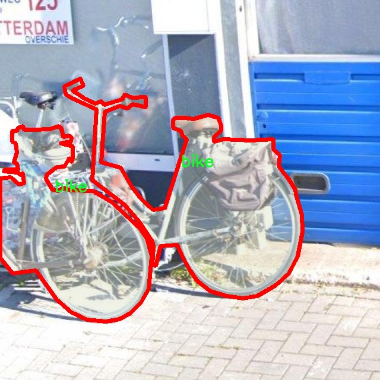

# 交通工具与动物实例分割系统源码＆数据集分享
 [yolov8-seg-C2f-SCConv＆yolov8-seg-repvit等50+全套改进创新点发刊_一键训练教程_Web前端展示]

### 1.研究背景与意义

项目参考[ILSVRC ImageNet Large Scale Visual Recognition Challenge](https://gitee.com/YOLOv8_YOLOv11_Segmentation_Studio/projects)

项目来源[AAAI Global Al lnnovation Contest](https://kdocs.cn/l/cszuIiCKVNis)

研究背景与意义

随着城市化进程的加快，交通工具与动物的数量日益增加，如何有效地进行实例分割以识别和分类这些对象，成为计算机视觉领域中的一个重要研究课题。实例分割不仅仅是对图像中物体的检测，更是对物体的精确分割，使得每个实例都能被单独识别和处理。近年来，YOLO（You Only Look Once）系列模型因其高效的实时检测能力而受到广泛关注，尤其是YOLOv8的推出，进一步提升了检测精度和速度。基于YOLOv8的改进版本，结合交通工具与动物的实例分割任务，具有重要的理论与实际意义。

首先，交通工具与动物的实例分割在智能交通、自动驾驶、环境监测等领域具有广泛的应用前景。通过对交通工具（如汽车、摩托车、卡车等）和动物（如狗、狸猫等）的准确识别与分割，可以为智能交通系统提供实时数据支持，帮助系统进行交通流量分析、事故预警等。同时，在城市环境中，动物的行为监测与保护也日益受到重视，实例分割技术能够为生态保护、动物行为研究提供有效的数据支撑。

其次，当前的实例分割技术在处理复杂场景时仍面临诸多挑战。传统的分割方法往往依赖于手工特征提取，难以适应多样化的交通工具和动物形态。而YOLOv8通过深度学习技术，能够自动学习特征，适应不同的环境与对象，提升了分割的准确性和鲁棒性。然而，YOLOv8在处理小目标和密集场景时仍存在一定的局限性，因此对其进行改进，以增强其在复杂场景下的表现，具有重要的研究价值。

本研究将基于YOLOv8模型，针对交通工具与动物的实例分割任务进行深入探讨。数据集包含1400张图像，涵盖9个类别，包括广告、自行车、汽车、起重机、狗、摩托车、狸猫、行人和卡车。这一数据集的多样性为模型的训练和验证提供了良好的基础，使得模型能够在不同的场景中进行有效的学习和适应。通过对数据集的分析与处理，研究将重点关注如何优化模型结构、改进损失函数、增强数据增强策略等，以提升模型在实例分割任务中的表现。

最后，本研究不仅有助于推动交通工具与动物实例分割技术的发展，也为相关领域的研究提供了新的思路和方法。通过改进YOLOv8模型，期望能够在实例分割的精度和效率上取得突破，为智能交通、生态保护等应用提供更为精准和高效的技术支持。这将为未来的研究和应用奠定坚实的基础，推动计算机视觉技术在实际场景中的广泛应用。

### 2.图片演示







##### 注意：由于此博客编辑较早，上面“2.图片演示”和“3.视频演示”展示的系统图片或者视频可能为老版本，新版本在老版本的基础上升级如下：（实际效果以升级的新版本为准）

  （1）适配了YOLOV8的“目标检测”模型和“实例分割”模型，通过加载相应的权重（.pt）文件即可自适应加载模型。

  （2）支持“图片识别”、“视频识别”、“摄像头实时识别”三种识别模式。

  （3）支持“图片识别”、“视频识别”、“摄像头实时识别”三种识别结果保存导出，解决手动导出（容易卡顿出现爆内存）存在的问题，识别完自动保存结果并导出到tempDir中。

  （4）支持Web前端系统中的标题、背景图等自定义修改，后面提供修改教程。

  另外本项目提供训练的数据集和训练教程,暂不提供权重文件（best.pt）,需要您按照教程进行训练后实现图片演示和Web前端界面演示的效果。

### 3.视频演示

[3.1 视频演示](https://www.bilibili.com/video/BV1ZS2UYdEDE/)

### 4.数据集信息展示

##### 4.1 本项目数据集详细数据（类别数＆类别名）

nc: 9
names: ['ad', 'bike', 'car', 'crane', 'dog', 'motorcycle', 'paguma', 'person', 'track']


##### 4.2 本项目数据集信息介绍

数据集信息展示

在本研究中，我们使用了名为“train detection”的数据集，以训练和改进YOLOv8-seg模型，专注于交通工具与动物的实例分割任务。该数据集的设计旨在提供丰富多样的图像样本，涵盖了多个类别的对象，以便模型能够在复杂的环境中进行准确的识别和分割。数据集包含九个类别，分别是：广告（ad）、自行车（bike）、汽车（car）、起重机（crane）、狗（dog）、摩托车（motorcycle）、果子狸（paguma）、人（person）和轨道（track）。这些类别的选择不仅考虑到了交通工具的多样性，还涵盖了常见的动物，确保模型能够在不同场景下进行有效的学习和推理。

数据集中的每个类别都经过精心标注，确保每个对象的边界框和分割掩码准确无误。这种高质量的标注是训练深度学习模型的基础，能够显著提高模型的性能。在实例分割任务中，模型不仅需要识别出对象的类别，还需要精确地分割出每个对象的形状，这对于交通工具和动物的识别尤为重要。例如，在复杂的城市环境中，汽车和自行车可能会与行人和其他物体重叠，准确的实例分割能够帮助模型更好地理解场景，做出更为精准的判断。

“train detection”数据集的多样性也体现在其图像的拍摄环境和角度上。数据集中包含了在不同天气条件、光照变化和背景复杂度下拍摄的图像，这使得模型在训练过程中能够学习到更为广泛的特征。这种多样性不仅提升了模型的鲁棒性，还使其在实际应用中能够更好地适应各种环境，减少因环境变化导致的识别错误。

在类别方面，数据集中的“ad”类别主要涉及与交通相关的广告牌，这为模型提供了额外的上下文信息，有助于提升交通工具的识别准确率。其他类别如“bike”、“car”和“motorcycle”则涵盖了多种交通工具，模型通过学习这些类别的特征，可以在实际应用中有效区分不同类型的车辆。而“dog”和“paguma”则代表了动物类别，模型在识别这些类别时，需要考虑到动物的多样性和运动状态，这对实例分割提出了更高的要求。

总之，“train detection”数据集为YOLOv8-seg模型的训练提供了丰富的样本和多样的类别，确保了模型在交通工具与动物实例分割任务中的有效性和准确性。通过对该数据集的深入分析和应用，我们期望能够推动实例分割技术的发展，提升智能交通系统和动物监测系统的性能，为相关领域的研究和应用提供有力支持。











### 5.全套项目环境部署视频教程（零基础手把手教学）

[5.1 环境部署教程链接（零基础手把手教学）](https://www.bilibili.com/video/BV1jG4Ve4E9t/?vd_source=bc9aec86d164b67a7004b996143742dc)


[5.2 安装Python虚拟环境创建和依赖库安装视频教程链接（零基础手把手教学）](https://www.bilibili.com/video/BV1nA4VeYEze/?vd_source=bc9aec86d164b67a7004b996143742dc)

### 6.手把手YOLOV8-seg训练视频教程（零基础小白有手就能学会）

[6.1 手把手YOLOV8-seg训练视频教程（零基础小白有手就能学会）](https://www.bilibili.com/video/BV1cA4VeYETe/?vd_source=bc9aec86d164b67a7004b996143742dc)


按照上面的训练视频教程链接加载项目提供的数据集，运行train.py即可开始训练



     Epoch   gpu_mem       box       obj       cls    labels  img_size
     1/200     0G   0.01576   0.01955  0.007536        22      1280: 100%|██████████| 849/849 [14:42<00:00,  1.04s/it]
               Class     Images     Labels          P          R     mAP@.5 mAP@.5:.95: 100%|██████████| 213/213 [01:14<00:00,  2.87it/s]
                 all       3395      17314      0.994      0.957      0.0957      0.0843

     Epoch   gpu_mem       box       obj       cls    labels  img_size
     2/200     0G   0.01578   0.01923  0.007006        22      1280: 100%|██████████| 849/849 [14:44<00:00,  1.04s/it]
               Class     Images     Labels          P          R     mAP@.5 mAP@.5:.95: 100%|██████████| 213/213 [01:12<00:00,  2.95it/s]
                 all       3395      17314      0.996      0.956      0.0957      0.0845

     Epoch   gpu_mem       box       obj       cls    labels  img_size
     3/200     0G   0.01561    0.0191  0.006895        27      1280: 100%|██████████| 849/849 [10:56<00:00,  1.29it/s]
               Class     Images     Labels          P          R     mAP@.5 mAP@.5:.95: 100%|███████   | 187/213 [00:52<00:00,  4.04it/s]
                 all       3395      17314      0.996      0.957      0.0957      0.0845


### 7.50+种全套YOLOV8-seg创新点代码加载调参视频教程（一键加载写好的改进模型的配置文件）

[7.1 50+种全套YOLOV8-seg创新点代码加载调参视频教程（一键加载写好的改进模型的配置文件）](https://www.bilibili.com/video/BV1Hw4VePEXv/?vd_source=bc9aec86d164b67a7004b996143742dc)

### 8.YOLOV8-seg图像分割算法原理

原始YOLOV8-seg算法原理

YOLOv8-seg算法是YOLO系列中的最新版本，旨在实现高效的目标检测与分割。与以往的YOLO版本相比，YOLOv8-seg在设计上采用了anchor-free的方法，这一创新使得模型在检测精度和速度上都有了显著提升。传统的anchor-based方法在复杂环境下，尤其是小目标检测时，往往会面临定位误差和对目标感知能力不足的问题。YOLOv8-seg通过引入一系列新的模块和技术，力求在这些方面取得突破。

YOLOv8-seg的网络结构主要由输入端、主干网络、Neck端和输出端四个模块组成。输入端负责对输入图像进行预处理，包括Mosaic数据增强、自适应图像缩放和灰度填充等。这些预处理步骤旨在提高模型对不同场景和条件下的适应能力，从而增强后续特征提取的有效性。

在主干网络中，YOLOv8-seg使用了C2f模块替代了传统的C3模块。C2f模块的设计灵感来源于YOLOv5的CSPDarknet结构，并结合了ELAN思想，旨在实现更丰富的特征提取。该模块通过分支结构，能够在特征提取过程中保留更多的上下文信息，从而提升对小目标的感知能力。具体而言，C2f模块通过多个卷积层和Bottleneck结构的组合，形成了一个高效的特征提取网络。这样的设计不仅增强了模型的梯度流动性，还提高了特征的重用率，使得网络在处理复杂场景时能够更好地捕捉细节信息。

Neck端采用了PAN（Path Aggregation Network）结构，旨在实现多尺度特征的融合。通过上采样和下采样的结合，YOLOv8-seg能够有效地整合来自不同层次的特征信息。这一过程不仅增强了网络对不同尺度目标的检测能力，还提高了模型在复杂背景下的鲁棒性。Neck端的设计使得模型能够在处理小目标时，充分利用上下文信息，从而减少漏检现象的发生。

输出端则采用了解耦头结构，这一设计使得分类和回归过程得以分离，进而加速了模型的收敛速度。YOLOv8-seg的输出包括多个尺度的特征图，这些特征图经过处理后能够有效地进行目标的分类和定位。为了提高模型的泛化能力，YOLOv8-seg在损失函数的选择上进行了创新，采用了MPDIoU损失函数替代了传统的CIoU损失函数。这一改进不仅提高了模型的精度，还增强了其在不同场景下的适应能力。

在小目标检测方面，YOLOv8-seg通过引入更小的检测头，进一步提升了网络对小目标的感知能力。这一策略有效地解决了传统YOLO模型在复杂水面环境下对小目标的漏检问题。此外，Neck端引入的GSConv和Slim-neck技术，旨在在保持检测精度的同时，降低计算量，使得模型在实际应用中更加高效。

YOLOv8-seg的训练过程中，采用了多种数据增强技术，以提高模型的鲁棒性和泛化能力。通过Mosaic增强、混合增强、空间扰动和颜色扰动等手段，模型能够在多样化的训练数据中学习到更为丰富的特征表示。这些增强策略不仅提升了模型的检测精度，还使得其在面对不同场景和条件时，能够保持较高的性能。

综上所述，YOLOv8-seg算法通过一系列创新设计，旨在解决传统YOLO模型在复杂环境下的不足。其在特征提取、特征融合和损失计算等方面的改进，使得模型在小目标检测和复杂背景下的表现得到了显著提升。随着YOLOv8-seg的不断发展与优化，未来有望在更多实际应用中展现出其强大的能力。


### 9.系统功能展示（检测对象为举例，实际内容以本项目数据集为准）

图9.1.系统支持检测结果表格显示

  图9.2.系统支持置信度和IOU阈值手动调节

  图9.3.系统支持自定义加载权重文件best.pt(需要你通过步骤5中训练获得)

  图9.4.系统支持摄像头实时识别

  图9.5.系统支持图片识别

  图9.6.系统支持视频识别

  图9.7.系统支持识别结果文件自动保存

  图9.8.系统支持Excel导出检测结果数据


### 10.50+种全套YOLOV8-seg创新点原理讲解（非科班也可以轻松写刊发刊，V11版本正在科研待更新）

#### 10.1 由于篇幅限制，每个创新点的具体原理讲解就不一一展开，具体见下列网址中的创新点对应子项目的技术原理博客网址【Blog】：


[10.1 50+种全套YOLOV8-seg创新点原理讲解链接](https://gitee.com/qunmasj/good)

#### 10.2 部分改进模块原理讲解(完整的改进原理见上图和技术博客链接)【如果此小节的图加载失败可以通过CSDN或者Github搜索该博客的标题访问原始博客，原始博客图片显示正常】

### YOLOv8简介

按照官方描述，YOLOv8 是一个 SOTA 模型，它建立在以前 YOLO 版本的成功基础上，并引入了新的功能和改进，以进一步提升性能和灵活性。具体创新包括一个新的骨干网络、一个新的 Ancher-Free 检测头和一个新的损失函数，可以在从 CPU 到 GPU 的各种硬件平台上运行。

不过 ultralytics 并没有直接将开源库命名为 YOLOv8，而是直接使用 ultralytics 这个词，原因是 ultralytics 将这个库定位为算法框架，而非某一个特定算法，一个主要特点是可扩展性。其希望这个库不仅仅能够用于 YOLO 系列模型，而是能够支持非 YOLO 模型以及分类分割姿态估计等各类任务。
总而言之，ultralytics 开源库的两个主要优点是：

融合众多当前 SOTA 技术于一体
未来将支持其他 YOLO 系列以及 YOLO 之外的更多算法


下表为官方在 COCO Val 2017 数据集上测试的 mAP、参数量和 FLOPs 结果。可以看出 YOLOv8 相比 YOLOv5 精度提升非常多，但是 N/S/M 模型相应的参数量和 FLOPs 都增加了不少，从上图也可以看出相比 YOLOV5 大部分模型推理速度变慢了。


额外提一句，现在各个 YOLO 系列改进算法都在 COCO 上面有明显性能提升，但是在自定义数据集上面的泛化性还没有得到广泛验证，至今依然听到不少关于 YOLOv5 泛化性能较优异的说法。对各系列 YOLO 泛化性验证也是 MMYOLO 中一个特别关心和重点发力的方向。

### YOLO-MS简介
实时目标检测，以YOLO系列为例，已在工业领域中找到重要应用，特别是在边缘设备（如无人机和机器人）中。与之前的目标检测器不同，实时目标检测器旨在在速度和准确性之间追求最佳平衡。为了实现这一目标，提出了大量的工作：从第一代DarkNet到CSPNet，再到最近的扩展ELAN，随着性能的快速增长，实时目标检测器的架构经历了巨大的变化。

尽管性能令人印象深刻，但在不同尺度上识别对象仍然是实时目标检测器面临的基本挑战。这促使作者设计了一个强大的编码器架构，用于学习具有表现力的多尺度特征表示。具体而言，作者从两个新的角度考虑为实时目标检测编码多尺度特征：

从局部视角出发，作者设计了一个具有简单而有效的分层特征融合策略的MS-Block。受到Res2Net的启发，作者在MS-Block中引入了多个分支来进行特征提取，但不同的是，作者使用了一个带有深度卷积的 Inverted Bottleneck Block块，以实现对大Kernel的高效利用。

从全局视角出发，作者提出随着网络加深逐渐增加卷积的Kernel-Size。作者在浅层使用小Kernel卷积来更高效地处理高分辨率特征。另一方面，在深层中，作者采用大Kernel卷积来捕捉广泛的信息。

基于以上设计原则，作者呈现了作者的实时目标检测器，称为YOLO-MS。为了评估作者的YOLO-MS的性能，作者在MS COCO数据集上进行了全面的实验。还提供了与其他最先进方法的定量比较，以展示作者方法的强大性能。如图1所示，YOLO-MS在计算性能平衡方面优于其他近期的实时目标检测器。


具体而言，YOLO-MS-XS在MS COCO上获得了43%+的AP得分，仅具有450万个可学习参数和8.7亿个FLOPs。YOLO-MS-S和YOLO-MS分别获得了46%+和51%+的AP，可学习参数分别为810万和2220万。此外，作者的工作还可以作为其他YOLO模型的即插即用模块。通常情况下，作者的方法可以将YOLOv8的AP从37%+显著提高到40%+，甚至还可以使用更少的参数和FLOPs。


#### Multi-Scale Building Block Design
CSP Block是一个基于阶段级梯度路径的网络，平衡了梯度组合和计算成本。它是广泛应用于YOLO系列的基本构建块。已经提出了几种变体，包括YOLOv4和YOLOv5中的原始版本，Scaled YOLOv4中的CSPVoVNet，YOLOv7中的ELAN，以及RTMDet中提出的大Kernel单元。作者在图2(a)和图2(b)中分别展示了原始CSP块和ELAN的结构。


上述实时检测器中被忽视的一个关键方面是如何在基本构建块中编码多尺度特征。其中一个强大的设计原则是Res2Net，它聚合了来自不同层次的特征以增强多尺度表示。然而，这一原则并没有充分探索大Kernel卷积的作用，而大Kernel卷积已经在基于CNN的视觉识别任务模型中证明有效。将大Kernel卷积纳入Res2Net的主要障碍在于它们引入的计算开销，因为构建块采用了标准卷积。在作者的方法中，作者提出用 Inverted Bottleneck Block替代标准的3 × 3卷积，以享受大Kernel卷积的好处。

基于前面的分析，作者提出了一个带有分层特征融合策略的全新Block，称为MS-Block，以增强实时目标检测器在提取多尺度特征时的能力，同时保持快速的推理速度。

MS-Block的具体结构如图2(c)所示。假设是输入特征。通过1×1卷积的转换后，X的通道维度增加到n*C。然后，作者将X分割成n个不同的组，表示为，其中。为了降低计算成本，作者选择n为3。

注意，除了之外，每个其他组都经过一个 Inverted Bottleneck Block层，用表示，其中k表示Kernel-Size，以获得。的数学表示如下：


根据这个公式，该博客的作者不将 Inverted Bottleneck Block层连接，使其作为跨阶段连接，并保留来自前面层的信息。最后，作者将所有分割连接在一起，并应用1×1卷积来在所有分割之间进行交互，每个分割都编码不同尺度的特征。当网络加深时，这个1×1卷积也用于调整通道数。

#### Heterogeneous Kernel Selection Protocol
除了构建块的设计外，作者还从宏观角度探讨了卷积的使用。之前的实时目标检测器在不同的编码器阶段采用了同质卷积（即具有相同Kernel-Size的卷积），但作者认为这不是提取多尺度语义信息的最佳选项。

在金字塔结构中，从检测器的浅阶段提取的高分辨率特征通常用于捕捉细粒度语义，将用于检测小目标。相反，来自网络较深阶段的低分辨率特征用于捕捉高级语义，将用于检测大目标。如果作者在所有阶段都采用统一的小Kernel卷积，深阶段的有效感受野（ERF）将受到限制，影响大目标的性能。在每个阶段中引入大Kernel卷积可以帮助解决这个问题。然而，具有大的ERF的大Kernel可以编码更广泛的区域，这增加了在小目标外部包含噪声信息的概率，并且降低了推理速度。

在这项工作中，作者建议在不同阶段中采用异构卷积，以帮助捕获更丰富的多尺度特征。具体来说，在编码器的第一个阶段中，作者采用最小Kernel卷积，而最大Kernel卷积位于最后一个阶段。随后，作者逐步增加中间阶段的Kernel-Size，使其与特征分辨率的增加保持一致。这种策略允许提取细粒度和粗粒度的语义信息，增强了编码器的多尺度特征表示能力。

正如图所示，作者将k的值分别分配给编码器中的浅阶段到深阶段，取值为3、5、7和9。作者将其称为异构Kernel选择（HKS）协议。


作者的HKS协议能够在深层中扩大感受野，而不会对浅层产生任何其他影响。此外，HKS不仅有助于编码更丰富的多尺度特征，还确保了高效的推理。

如表1所示，将大Kernel卷积应用于高分辨率特征会产生较高的计算开销。然而，作者的HKS协议在低分辨率特征上采用大Kernel卷积，从而与仅使用大Kernel卷积相比，大大降低了计算成本。


在实践中，作者经验性地发现，采用HKS协议的YOLO-MS的推理速度几乎与仅使用深度可分离的3 × 3卷积相同。

#### Architecture
如图所示，作者模型的Backbone由4个阶段组成，每个阶段后面跟随1个步长为2的3 × 3卷积进行下采样。在第3个阶段后，作者添加了1个SPP块，与RTMDet中一样。在作者的编码器上，作者使用PAFPN作为Neck来构建特征金字塔[31, 35]。它融合了从Backbone不同阶段提取的多尺度特征。Neck中使用的基本构建块也是作者的MS-Block，在其中使用3 × 3深度可分离卷积进行快速推理。

此外，为了在速度和准确性之间取得更好的平衡，作者将Backbone中多级特征的通道深度减半。作者提供了3个不同尺度的YOLO-MS变体，即YOLO-MS-XS、YOLO-MS-S和YOLO-MS。不同尺度的YOLO-MS的详细配置列在表2中。对于YOLO-MS的其他部分，作者将其保持与RTMDet相同。


### 11.项目核心源码讲解（再也不用担心看不懂代码逻辑）

#### 11.1 ultralytics\nn\extra_modules\block.py

以下是对给定代码的核心部分进行分析和详细注释的结果：

```python
import torch
import torch.nn as nn
import torch.nn.functional as F

def autopad(k, p=None, d=1):
    """自动填充以确保输出形状与输入形状相同"""
    if d > 1:
        k = d * (k - 1) + 1 if isinstance(k, int) else [d * (x - 1) + 1 for x in k]  # 实际的卷积核大小
    if p is None:
        p = k // 2 if isinstance(k, int) else [x // 2 for x in k]  # 自动填充
    return p

class DyReLU(nn.Module):
    """动态ReLU激活函数"""
    def __init__(self, inp, reduction=4, lambda_a=1.0, K2=True, use_bias=True):
        super(DyReLU, self).__init__()
        self.oup = inp
        self.lambda_a = lambda_a * 2
        self.avg_pool = nn.AdaptiveAvgPool2d(1)  # 自适应平均池化到1x1

        # 确定压缩比例
        squeeze = inp // reduction
        self.fc = nn.Sequential(
            nn.Linear(inp, squeeze),  # 全连接层
            nn.ReLU(inplace=True),
            nn.Linear(squeeze, self.oup * (4 if K2 else 2)),  # 输出4个或2个参数
            h_sigmoid()  # 使用h_sigmoid激活函数
        )

    def forward(self, x):
        """前向传播"""
        b, c, h, w = x.size()  # 获取输入的形状
        y = self.avg_pool(x).view(b, c)  # 平均池化并重塑形状
        y = self.fc(y).view(b, self.oup * 4, 1, 1)  # 通过全连接层并重塑
        # 处理不同的输出情况
        # 这里省略了具体的处理逻辑以简化代码
        return out  # 返回计算结果

class DyHeadBlock(nn.Module):
    """动态头部块，包含多种注意力机制"""
    def __init__(self, in_channels, norm_type='GN'):
        super().__init__()
        self.spatial_conv_high = DyDCNv2(in_channels, in_channels)  # 高层空间卷积
        self.spatial_conv_mid = DyDCNv2(in_channels, in_channels)  # 中层空间卷积
        self.spatial_conv_low = DyDCNv2(in_channels, in_channels, stride=2)  # 低层空间卷积
        self.spatial_conv_offset = nn.Conv2d(in_channels, 27, 3, padding=1)  # 偏移和掩码卷积

    def forward(self, x):
        """前向传播"""
        outs = []
        for level in range(len(x)):
            offset_and_mask = self.spatial_conv_offset(x[level])  # 计算偏移和掩码
            # 省略了具体的处理逻辑以简化代码
            outs.append(result)  # 将结果添加到输出列表
        return outs  # 返回所有层的输出

class Fusion(nn.Module):
    """融合模块，用于不同输入特征的融合"""
    def __init__(self, inc_list, fusion='bifpn'):
        super().__init__()
        self.fusion = fusion
        if self.fusion == 'bifpn':
            self.fusion_weight = nn.Parameter(torch.ones(len(inc_list), dtype=torch.float32), requires_grad=True)

    def forward(self, x):
        """前向传播"""
        if self.fusion == 'bifpn':
            fusion_weight = F.relu(self.fusion_weight.clone())
            fusion_weight = fusion_weight / (torch.sum(fusion_weight, dim=0))  # 归一化权重
            return torch.sum(torch.stack([fusion_weight[i] * x[i] for i in range(len(x))], dim=0), dim=0)  # 加权融合
        # 省略其他融合方式以简化代码

# 省略了其他类和函数以简化代码
```

### 注释说明：
1. **autopad**: 自动计算填充，以确保卷积操作后输出的形状与输入相同。
2. **DyReLU**: 动态ReLU激活函数，根据输入的特征自适应调整激活值。
3. **DyHeadBlock**: 该模块实现了多种空间卷积和注意力机制，主要用于特征提取。
4. **Fusion**: 融合模块，负责将不同来源的特征进行加权融合，支持多种融合方式。

以上是对代码的核心部分进行了提炼和注释，其他类和函数的具体实现可以根据需要进行类似的处理。

这个文件`ultralytics\nn\extra_modules\block.py`包含了许多深度学习模块的实现，主要用于构建神经网络的不同组件，特别是在计算机视觉任务中。以下是对文件中代码的逐行分析和说明。

首先，文件导入了一些必要的库，包括`torch`和`torch.nn`，这些是构建神经网络的基础库。还引入了一些自定义模块和功能，如卷积操作、注意力机制等。

接下来，定义了一些通用的辅助函数，例如`autopad`用于自动计算卷积层的填充，以确保输出的尺寸与输入相同。

文件中定义了多个类，每个类代表一种特定的网络模块或层。比如：

- `swish`、`h_swish`和`h_sigmoid`是激活函数的实现，分别对应Swish、Hard Swish和Hard Sigmoid。
- `DyReLU`是一个动态ReLU模块，它根据输入的特征动态调整激活值。
- `DyDCNv2`和`DyHeadBlock`等类实现了动态卷积和注意力机制，用于增强网络的表达能力。

`Fusion`类实现了不同特征图的融合策略，支持加权、适应性融合、拼接等多种方式。

`C3_Faster`和`C2f_Faster`等类是网络中的基本构建块，通常用于构建更复杂的网络结构。这些类通过组合不同的卷积层和激活函数来实现特定的功能。

`Bottleneck`和`C3`等类则是更高级的模块，通常用于构建残差网络（ResNet）或其他现代网络架构。它们通过跳跃连接来帮助训练更深的网络。

文件中还实现了一些注意力机制的模块，如`C3_DAttention`和`C2f_DAttention`，这些模块通过对特征图进行加权来增强网络对重要特征的关注。

最后，文件中还定义了一些与特定网络架构相关的模块，如`C3_KW`和`C2f_KW`，这些模块可能用于特定的任务或数据集。

总的来说，这个文件实现了许多用于构建深度学习模型的基础组件，涵盖了卷积、激活、注意力机制、特征融合等多个方面，为构建复杂的神经网络提供了灵活的基础。

#### 11.2 ui.py

以下是经过简化并添加详细中文注释的核心代码部分：

```python
import sys
import subprocess

def run_script(script_path):
    """
    使用当前 Python 环境运行指定的脚本。

    参数:
        script_path (str): 要运行的脚本路径

    返回:
        None
    """
    # 获取当前 Python 解释器的路径
    python_path = sys.executable

    # 构建运行命令，使用 streamlit 运行指定的脚本
    command = f'"{python_path}" -m streamlit run "{script_path}"'

    # 执行命令并等待其完成
    result = subprocess.run(command, shell=True)
    
    # 检查命令执行的返回码，如果不为0则表示出错
    if result.returncode != 0:
        print("脚本运行出错。")

# 如果该脚本是主程序，则执行以下代码
if __name__ == "__main__":
    # 指定要运行的脚本路径
    script_path = "web.py"  # 假设脚本在当前目录下

    # 调用函数运行指定的脚本
    run_script(script_path)
```

### 代码说明：
1. **导入模块**：
   - `sys`：用于获取当前 Python 解释器的路径。
   - `subprocess`：用于执行外部命令。

2. **`run_script` 函数**：
   - 该函数接收一个脚本路径作为参数，并使用当前 Python 环境运行该脚本。
   - 使用 `sys.executable` 获取当前 Python 解释器的路径。
   - 构建命令字符串，使用 `streamlit` 模块运行指定的脚本。
   - 使用 `subprocess.run` 执行命令，并等待其完成。
   - 检查返回码，如果不为0，表示脚本运行出错。

3. **主程序部分**：
   - 使用 `if __name__ == "__main__":` 确保该代码块仅在脚本作为主程序运行时执行。
   - 指定要运行的脚本路径（在此示例中为 `"web.py"`）。
   - 调用 `run_script` 函数以运行指定的脚本。

这个程序文件名为 `ui.py`，其主要功能是通过当前的 Python 环境来运行一个指定的脚本。程序首先导入了必要的模块，包括 `sys`、`os` 和 `subprocess`，以及一个自定义的 `abs_path` 函数，用于获取文件的绝对路径。

在 `run_script` 函数中，首先获取当前 Python 解释器的路径，存储在 `python_path` 变量中。接着，构建一个命令字符串，该命令使用 `streamlit` 模块来运行指定的脚本，脚本路径通过参数 `script_path` 传入。使用 `subprocess.run` 方法执行这个命令，并设置 `shell=True` 以便在 shell 中运行命令。

如果脚本运行过程中出现错误，返回的 `returncode` 不为零，程序会打印出“脚本运行出错”的提示信息。

在文件的主程序部分，首先通过 `abs_path` 函数指定要运行的脚本路径，这里是 `web.py`。然后调用 `run_script` 函数来执行这个脚本。

整体来看，这个程序的目的是为了方便地在当前 Python 环境中运行一个 Streamlit 应用脚本，提供了一种简单的方式来启动 Web 应用。

#### 11.3 ultralytics\models\fastsam\model.py

```python
# Ultralytics YOLO 🚀, AGPL-3.0 license

from pathlib import Path  # 导入Path类，用于处理文件路径
from ultralytics.engine.model import Model  # 从ultralytics库中导入Model类

from .predict import FastSAMPredictor  # 导入FastSAMPredictor类，用于快速预测
from .val import FastSAMValidator  # 导入FastSAMValidator类，用于快速验证


class FastSAM(Model):
    """
    FastSAM模型接口。

    示例：
        ```python
        from ultralytics import FastSAM

        model = FastSAM('last.pt')  # 加载模型
        results = model.predict('ultralytics/assets/bus.jpg')  # 对图片进行预测
        ```
    """

    def __init__(self, model='FastSAM-x.pt'):
        """初始化FastSAM类，调用父类Model的初始化方法，并设置默认模型为'FastSAM-x.pt'。"""
        # 如果传入的模型名称是'FastSAM.pt'，则将其更改为'FastSAM-x.pt'
        if str(model) == 'FastSAM.pt':
            model = 'FastSAM-x.pt'
        # 确保传入的模型文件后缀不是.yaml或.yml，FastSAM模型只支持预训练模型
        assert Path(model).suffix not in ('.yaml', '.yml'), 'FastSAM models only support pre-trained models.'
        # 调用父类的初始化方法，设置模型和任务类型为'segment'
        super().__init__(model=model, task='segment')

    @property
    def task_map(self):
        """返回一个字典，将分割任务映射到相应的预测器和验证器类。"""
        return {'segment': {'predictor': FastSAMPredictor, 'validator': FastSAMValidator}}
```

### 代码核心部分及注释说明：

1. **导入模块**：
   - `from pathlib import Path`：用于处理文件路径，方便检查模型文件的后缀。
   - `from ultralytics.engine.model import Model`：导入基础模型类，FastSAM类将继承自此类。

2. **FastSAM类定义**：
   - `class FastSAM(Model)`：定义FastSAM类，继承自Model类，表示这是一个特定的模型接口。

3. **初始化方法**：
   - `def __init__(self, model='FastSAM-x.pt')`：构造函数，设置模型的默认值。
   - 通过`assert`语句确保模型文件后缀的合法性，确保只使用预训练模型。

4. **任务映射属性**：
   - `@property def task_map(self)`：定义一个属性，返回一个字典，映射分割任务到相应的预测器和验证器类，便于后续的任务处理。

这个程序文件定义了一个名为 `FastSAM` 的类，属于 Ultralytics YOLO 框架的一部分，主要用于图像分割任务。文件首先导入了必要的模块，包括 `Path` 类用于路径操作，以及从 `ultralytics.engine.model` 导入的 `Model` 类，后者是 FastSAM 类的父类。此外，还导入了 `FastSAMPredictor` 和 `FastSAMValidator`，这两个类分别用于预测和验证功能。

`FastSAM` 类的文档字符串中提供了一个简单的使用示例，展示了如何加载模型并对图像进行预测。用户可以通过实例化 `FastSAM` 类并传入模型文件名来创建模型对象，然后调用 `predict` 方法进行图像处理。

在 `__init__` 方法中，类首先检查传入的模型名称，如果模型名称是 `'FastSAM.pt'`，则将其更改为 `'FastSAM-x.pt'`。接着，代码使用 `assert` 语句确保传入的模型文件后缀不是 `.yaml` 或 `.yml`，因为 FastSAM 模型只支持预训练模型。最后，调用父类的 `__init__` 方法，传入模型名称和任务类型（在这里是 `'segment'`）。

`task_map` 属性返回一个字典，映射了分割任务到相应的预测器和验证器类。这使得 `FastSAM` 类能够灵活地处理不同的任务，并使用适当的工具进行预测和验证。

整体来看，这个文件为 FastSAM 模型提供了一个清晰的接口，方便用户进行图像分割任务的实现。

#### 11.4 ultralytics\nn\extra_modules\ops_dcnv3\test.py

以下是代码中最核心的部分，并附上详细的中文注释：

```python
import torch
from functions.dcnv3_func import DCNv3Function, dcnv3_core_pytorch

# 输入和输出的尺寸参数
H_in, W_in = 8, 8  # 输入图像的高度和宽度
N, M, D = 2, 4, 16  # N: 批量大小, M: 通道数, D: 特征维度
Kh, Kw = 3, 3  # 卷积核的高度和宽度
remove_center = False  # 是否移除中心点
P = Kh * Kw - remove_center  # 每个卷积核的点数
offset_scale = 2.0  # 偏移量的缩放因子
pad = 1  # 填充大小
dilation = 1  # 膨胀大小
stride = 1  # 步幅
# 计算输出的高度和宽度
H_out = (H_in + 2 * pad - (dilation * (Kh - 1) + 1)) // stride + 1
W_out = (W_in + 2 * pad - (dilation * (Kw - 1) + 1)) // stride + 1

torch.manual_seed(3)  # 设置随机种子以确保可重复性

@torch.no_grad()
def check_forward_equal_with_pytorch_double():
    # 生成随机输入数据
    input = torch.rand(N, H_in, W_in, M*D).cuda() * 0.01
    offset = torch.rand(N, H_out, W_out, M*P*2).cuda() * 10
    mask = torch.rand(N, H_out, W_out, M, P).cuda() + 1e-5
    mask /= mask.sum(-1, keepdim=True)  # 归一化mask
    mask = mask.reshape(N, H_out, W_out, M*P)

    # 使用PyTorch的核心函数进行前向计算
    output_pytorch = dcnv3_core_pytorch(
        input.double(),
        offset.double(),
        mask.double(),
        Kh, Kw, stride, stride, Kh // 2, Kw // 2, dilation, dilation, M, D, offset_scale, remove_center).detach().cpu()

    # 使用自定义的DCNv3函数进行前向计算
    output_cuda = DCNv3Function.apply(
        input.double(),
        offset.double(),
        mask.double(),
        Kh, Kw, stride, stride, Kh // 2, Kw // 2, dilation, dilation, M, D, offset_scale,
        im2col_step=2, remove_center).detach().cpu()

    # 检查两个输出是否相近
    fwdok = torch.allclose(output_cuda, output_pytorch)
    max_abs_err = (output_cuda - output_pytorch).abs().max()  # 最大绝对误差
    max_rel_err = ((output_cuda - output_pytorch).abs() /
                   output_pytorch.abs()).max()  # 最大相对误差
    print('>>> forward double')
    print(f'* {fwdok} check_forward_equal_with_pytorch_double: max_abs_err {max_abs_err:.2e} max_rel_err {max_rel_err:.2e}')

# 省略其他函数的实现，保持结构一致

if __name__ == '__main__':
    # 执行前向一致性检查
    check_forward_equal_with_pytorch_double()
    # 省略其他函数调用
```

### 代码说明：
1. **导入必要的库**：导入了PyTorch和自定义的DCNv3函数。
2. **设置输入参数**：定义了输入图像的尺寸、卷积核的尺寸、填充、步幅等参数。
3. **计算输出尺寸**：根据输入尺寸和卷积参数计算输出的高度和宽度。
4. **随机数据生成**：在检查函数中生成随机输入、偏移量和mask，并进行归一化处理。
5. **前向计算**：分别使用PyTorch的核心函数和自定义的DCNv3函数进行前向计算，并比较它们的输出是否一致。
6. **误差计算**：计算最大绝对误差和最大相对误差，并输出结果。

### 注意：
为了保持代码的简洁性和核心功能，省略了其他函数的实现，但它们的结构和逻辑与`check_forward_equal_with_pytorch_double`函数类似。

这个程序文件是一个用于测试和验证深度学习中 DCNv3（Deformable Convolutional Networks v3）功能的 Python 脚本。它主要使用 PyTorch 框架，包含了一些用于前向和反向传播的检查函数，以及时间性能测试。

首先，文件中导入了一些必要的库，包括 PyTorch 和一些数学函数。接着，定义了一些输入参数，例如输入的高度和宽度（H_in 和 W_in）、批量大小（N）、通道数（M 和 D）、卷积核的高度和宽度（Kh 和 Kw）等。这些参数用于后续的张量创建和计算。

接下来的部分定义了几个函数，用于验证前向传播和反向传播的结果是否与 PyTorch 的实现相同。`check_forward_equal_with_pytorch_double` 和 `check_forward_equal_with_pytorch_float` 函数分别用于检查双精度和单精度浮点数的前向传播结果是否一致。它们通过生成随机输入、偏移量和掩码，调用自定义的 `dcnv3_core_pytorch` 函数和 `DCNv3Function.apply` 方法，比较它们的输出，并计算最大绝对误差和相对误差。

类似地，`check_backward_equal_with_pytorch_double` 和 `check_backward_equal_with_pytorch_float` 函数用于验证反向传播的梯度是否一致。它们同样生成随机数据，并通过调用前向传播函数后执行反向传播，比较计算得到的梯度。

最后，`check_time_cost` 函数用于测试 DCNv3 函数的时间性能。它生成较大的输入张量，并多次调用 DCNv3 函数以测量平均执行时间。

在 `__main__` 块中，程序依次调用前向和反向检查函数，并测试不同通道数的情况，最后进行时间性能测试。整体来看，这个脚本的目的是确保 DCNv3 的实现是正确的，并且在性能上也能满足需求。

#### 11.5 ultralytics\trackers\utils\kalman_filter.py

以下是代码中最核心的部分，并附上详细的中文注释：

```python
import numpy as np
import scipy.linalg

class KalmanFilterXYAH:
    """
    Kalman滤波器，用于在图像空间中跟踪边界框。
    状态空间为8维（x, y, a, h, vx, vy, va, vh），包含边界框中心位置（x, y），
    纵横比a，高度h及其各自的速度。
    物体运动遵循恒定速度模型。
    """

    def __init__(self):
        """初始化卡尔曼滤波器模型矩阵，设置运动和观测的不确定性权重。"""
        ndim, dt = 4, 1.  # 状态维度和时间增量

        # 创建卡尔曼滤波器模型矩阵
        self._motion_mat = np.eye(2 * ndim, 2 * ndim)  # 运动矩阵
        for i in range(ndim):
            self._motion_mat[i, ndim + i] = dt  # 设置速度部分
        self._update_mat = np.eye(ndim, 2 * ndim)  # 更新矩阵

        # 运动和观测的不确定性相对于当前状态估计选择的权重
        self._std_weight_position = 1. / 20  # 位置标准差权重
        self._std_weight_velocity = 1. / 160  # 速度标准差权重

    def initiate(self, measurement):
        """
        从未关联的测量值创建跟踪。

        参数
        ----------
        measurement : ndarray
            边界框坐标（x, y, a, h），其中（x, y）为中心位置，a为纵横比，h为高度。

        返回
        -------
        (ndarray, ndarray)
            返回新跟踪的均值向量（8维）和协方差矩阵（8x8维）。
            未观测的速度初始化为0均值。
        """
        mean_pos = measurement  # 初始化位置均值
        mean_vel = np.zeros_like(mean_pos)  # 初始化速度均值为0
        mean = np.r_[mean_pos, mean_vel]  # 合并位置和速度均值

        # 计算协方差矩阵的标准差
        std = [
            2 * self._std_weight_position * measurement[3],  # 高度的标准差
            2 * self._std_weight_position * measurement[3],  # 高度的标准差
            1e-2,  # 纵横比的标准差
            2 * self._std_weight_position * measurement[3],  # 高度的标准差
            10 * self._std_weight_velocity * measurement[3],  # 速度的标准差
            10 * self._std_weight_velocity * measurement[3],  # 速度的标准差
            1e-5,  # 纵横比速度的标准差
            10 * self._std_weight_velocity * measurement[3]   # 速度的标准差
        ]
        covariance = np.diag(np.square(std))  # 协方差矩阵
        return mean, covariance  # 返回均值和协方差

    def predict(self, mean, covariance):
        """
        执行卡尔曼滤波器预测步骤。

        参数
        ----------
        mean : ndarray
            先前时间步的对象状态的8维均值向量。
        covariance : ndarray
            先前时间步的对象状态的8x8维协方差矩阵。

        返回
        -------
        (ndarray, ndarray)
            返回预测状态的均值向量和协方差矩阵。
        """
        # 计算位置和速度的标准差
        std_pos = [
            self._std_weight_position * mean[3],  # 高度的标准差
            self._std_weight_position * mean[3],  # 高度的标准差
            1e-2,  # 纵横比的标准差
            self._std_weight_position * mean[3]   # 高度的标准差
        ]
        std_vel = [
            self._std_weight_velocity * mean[3],  # 速度的标准差
            self._std_weight_velocity * mean[3],  # 速度的标准差
            1e-5,  # 纵横比速度的标准差
            self._std_weight_velocity * mean[3]   # 速度的标准差
        ]
        motion_cov = np.diag(np.square(np.r_[std_pos, std_vel]))  # 运动协方差矩阵

        mean = np.dot(mean, self._motion_mat.T)  # 更新均值
        covariance = np.linalg.multi_dot((self._motion_mat, covariance, self._motion_mat.T)) + motion_cov  # 更新协方差

        return mean, covariance  # 返回更新后的均值和协方差

    def update(self, mean, covariance, measurement):
        """
        执行卡尔曼滤波器校正步骤。

        参数
        ----------
        mean : ndarray
            预测状态的均值向量（8维）。
        covariance : ndarray
            状态的协方差矩阵（8x8维）。
        measurement : ndarray
            4维测量向量（x, y, a, h），其中（x, y）为中心位置，a为纵横比，h为高度。

        返回
        -------
        (ndarray, ndarray)
            返回测量校正后的状态分布。
        """
        projected_mean, projected_cov = self.project(mean, covariance)  # 投影到测量空间

        # 计算卡尔曼增益
        chol_factor, lower = scipy.linalg.cho_factor(projected_cov, lower=True, check_finite=False)
        kalman_gain = scipy.linalg.cho_solve((chol_factor, lower),
                                             np.dot(covariance, self._update_mat.T).T,
                                             check_finite=False).T
        innovation = measurement - projected_mean  # 计算创新

        new_mean = mean + np.dot(innovation, kalman_gain.T)  # 更新均值
        new_covariance = covariance - np.linalg.multi_dot((kalman_gain, projected_cov, kalman_gain.T))  # 更新协方差
        return new_mean, new_covariance  # 返回更新后的均值和协方差
```

### 代码核心部分说明：
1. **KalmanFilterXYAH类**：这是一个简单的卡尔曼滤波器，用于跟踪图像空间中的边界框。它使用8维状态空间，包括位置、纵横比、高度及其速度。
2. **初始化方法**：设置状态转移矩阵和观测矩阵，并定义运动和观测的不确定性权重。
3. **initiate方法**：根据测量值初始化跟踪状态，包括均值和协方差矩阵。
4. **predict方法**：执行预测步骤，更新状态的均值和协方差。
5. **update方法**：执行校正步骤，根据新的测量值更新状态的均值和协方差。

这个代码的主要功能是实现卡尔曼滤波器的基本操作，包括初始化、预测和更新状态。

这个程序文件实现了一个简单的卡尔曼滤波器，用于在图像空间中跟踪边界框。它定义了两个类：`KalmanFilterXYAH`和`KalmanFilterXYWH`，分别用于处理不同的边界框表示方式。

`KalmanFilterXYAH`类的状态空间是8维的，包括边界框中心位置（x, y）、宽高比（a）、高度（h）及其各自的速度（vx, vy, va, vh）。该类使用常速度模型来描述物体运动，边界框的位置被视为状态空间的直接观测。类的初始化方法设置了运动和观测的不确定性权重，并创建了卡尔曼滤波器的模型矩阵。

`initiate`方法用于从未关联的测量值创建跟踪，返回新的跟踪的均值向量和协方差矩阵。`predict`方法执行卡尔曼滤波的预测步骤，更新状态的均值和协方差。`project`方法将状态分布投影到测量空间，以便进行后续的更新。`update`方法执行卡尔曼滤波的校正步骤，结合预测的状态和新的测量值来更新状态分布。

`gating_distance`方法计算状态分布与测量值之间的门控距离，支持使用不同的距离度量方法（如马哈距离）。这个方法可以帮助判断测量值是否与当前状态分布相符。

`KalmanFilterXYWH`类继承自`KalmanFilterXYAH`，其状态空间也为8维，但使用宽度（w）和高度（h）作为边界框的参数，而不是宽高比（a）和高度（h）。该类重写了`initiate`、`predict`、`project`和`update`方法，以适应新的边界框表示。

总体而言，这个文件实现了卡尔曼滤波器的基本功能，适用于物体跟踪任务，能够处理不同的边界框表示方式，并通过预测和更新步骤来持续改进状态估计。

#### 11.6 train.py

以下是经过简化和注释的核心代码部分：

```python
import os
import torch
import yaml
from ultralytics import YOLO  # 导入YOLO模型库

if __name__ == '__main__':  # 确保该模块被直接运行时才执行以下代码
    # 设置训练参数
    workers = 1  # 数据加载的工作进程数
    batch = 8  # 每个批次的样本数量
    device = "0" if torch.cuda.is_available() else "cpu"  # 检查是否有可用的GPU

    # 获取数据集配置文件的绝对路径
    data_path = abs_path(f'datasets/data/data.yaml', path_type='current')

    # 读取YAML文件并修改路径
    with open(data_path, 'r') as file:
        data = yaml.load(file, Loader=yaml.FullLoader)  # 读取YAML文件内容

    # 如果YAML文件中包含训练、验证和测试数据的路径，则进行修改
    if 'train' in data and 'val' in data and 'test' in data:
        directory_path = os.path.dirname(data_path.replace(os.sep, '/'))  # 获取目录路径
        data['train'] = directory_path + '/train'  # 更新训练数据路径
        data['val'] = directory_path + '/val'  # 更新验证数据路径
        data['test'] = directory_path + '/test'  # 更新测试数据路径

        # 将修改后的数据写回YAML文件
        with open(data_path, 'w') as file:
            yaml.safe_dump(data, file, sort_keys=False)

    # 加载YOLO模型
    model = YOLO(r"C:\codeseg\codenew\50+种YOLOv8算法改进源码大全和调试加载训练教程（非必要）\改进YOLOv8模型配置文件\yolov8-seg-C2f-Faster.yaml").load("./weights/yolov8s-seg.pt")

    # 开始训练模型
    results = model.train(
        data=data_path,  # 指定训练数据的配置文件路径
        device=device,  # 使用的设备（GPU或CPU）
        workers=workers,  # 数据加载的工作进程数
        imgsz=640,  # 输入图像的大小
        epochs=100,  # 训练的轮数
        batch=batch,  # 每个批次的样本数量
    )
```

### 代码注释说明：
1. **导入必要的库**：引入了操作系统、PyTorch、YAML处理库和YOLO模型库。
2. **主程序入口**：通过`if __name__ == '__main__':`确保只有在直接运行该脚本时才执行以下代码。
3. **设置训练参数**：定义了数据加载的工作进程数、批次大小和设备类型（GPU或CPU）。
4. **读取和修改YAML配置文件**：
   - 读取数据集的配置文件，获取训练、验证和测试数据的路径，并更新为绝对路径。
   - 将修改后的数据写回到YAML文件中。
5. **加载YOLO模型**：根据指定的配置文件和权重文件加载YOLO模型。
6. **训练模型**：调用`model.train()`方法开始训练，传入数据路径、设备、工作进程数、图像大小、训练轮数和批次大小等参数。

这个程序文件`train.py`主要用于训练YOLO（You Only Look Once）模型，特别是YOLOv8版本的模型。程序的结构相对简单，主要分为几个部分。

首先，程序导入了必要的库，包括`os`、`torch`、`yaml`和`ultralytics`中的YOLO模型。`matplotlib`库用于绘图，设置为使用`TkAgg`后端。

接下来，程序通过`if __name__ == '__main__':`语句确保只有在直接运行该脚本时才会执行以下代码。首先定义了一些参数，包括`workers`（数据加载的工作进程数）、`batch`（每个批次的大小）和`device`（用于训练的设备，若有可用的GPU则使用GPU，否则使用CPU）。

然后，程序获取数据集的配置文件路径，这个路径是一个YAML文件，包含了训练、验证和测试数据的路径。通过`abs_path`函数，程序将相对路径转换为绝对路径，并将路径中的分隔符统一为Unix风格的斜杠。

接下来，程序读取YAML文件的内容，并检查其中是否包含`train`、`val`和`test`字段。如果这些字段存在，程序将它们的值修改为对应的绝对路径，并将修改后的内容写回到YAML文件中。

在模型加载部分，程序指定了一个YOLOv8模型的配置文件，并加载了预训练的权重文件。此处提供了多种模型配置文件的注释，说明不同模型对设备的要求可能不同。

最后，程序调用`model.train()`方法开始训练模型，传入了数据配置文件路径、设备、工作进程数、输入图像大小、训练的epoch数量和批次大小等参数。这些参数决定了训练过程的具体设置。

整体来看，这个程序是一个完整的YOLOv8模型训练脚本，能够根据指定的数据集和模型配置进行训练。

### 12.系统整体结构（节选）

### 整体功能和构架概括

该项目主要围绕深度学习模型的构建、训练和推理，特别是针对计算机视觉任务（如目标检测和图像分割）进行优化。项目使用了Ultralytics的YOLO（You Only Look Once）框架，提供了一系列模块和工具来支持模型的训练、推理、跟踪和评估。

整体架构包括以下几个部分：

1. **模型构建**：通过`ultralytics\nn\extra_modules\block.py`等文件定义了各种神经网络模块和层，以便于构建复杂的深度学习模型。
2. **训练过程**：`train.py`负责设置训练参数、加载数据集和模型，并启动训练过程。
3. **推理和预测**：通过`ultralytics\models\fastsam\model.py`、`ultralytics\engine\predictor.py`等文件实现了模型的推理功能，支持对新数据的预测。
4. **工具和实用程序**：包括卡尔曼滤波器（`kalman_filter.py`）用于目标跟踪，DCNv3（`ops_dcnv3\test.py`）用于处理可变形卷积等。
5. **用户界面**：`ui.py`提供了一个简单的用户界面，用于启动和运行模型。

### 文件功能整理表

| 文件路径                                         | 功能描述                                                     |
|--------------------------------------------------|------------------------------------------------------------|
| `ultralytics\nn\extra_modules\block.py`         | 定义各种神经网络模块和层，支持模型构建。                   |
| `ui.py`                                         | 提供一个简单的用户界面，用于运行模型脚本。                  |
| `ultralytics\models\fastsam\model.py`           | 实现FastSAM模型的定义和接口，支持图像分割任务。            |
| `ultralytics\nn\extra_modules\ops_dcnv3\test.py` | 测试和验证DCNv3（可变形卷积）功能的正确性和性能。          |
| `ultralytics\trackers\utils\kalman_filter.py`   | 实现卡尔曼滤波器，用于目标跟踪，支持不同的边界框表示。     |
| `train.py`                                       | 设置训练参数、加载数据集和模型，并启动模型训练过程。      |
| `ultralytics\models\utils\__init__.py`          | 初始化模型相关的工具和模块。                               |
| `ultralytics\utils\instance.py`                  | 提供实例化相关的工具函数，支持模型的实例化和管理。         |
| `ultralytics\models\yolo\classify\predict.py`   | 实现YOLO模型的分类预测功能。                               |
| `ultralytics\utils\torch_utils.py`               | 提供与PyTorch相关的实用工具函数，支持模型训练和推理。      |
| `ultralytics\engine\predictor.py`                | 实现模型的推理功能，处理输入数据并生成预测结果。          |
| `ultralytics\utils\atss.py`                       | 实现ATSS（Adaptive Training Sample Selection）相关功能。   |
| `model.py`                                       | 可能包含模型的定义和相关功能，具体功能需进一步分析。      |

这个表格总结了项目中各个文件的主要功能，帮助理解整个项目的结构和各个模块之间的关系。

注意：由于此博客编辑较早，上面“11.项目核心源码讲解（再也不用担心看不懂代码逻辑）”中部分代码可能会优化升级，仅供参考学习，完整“训练源码”、“Web前端界面”和“50+种创新点源码”以“14.完整训练+Web前端界面+50+种创新点源码、数据集获取”的内容为准。

### 13.图片、视频、摄像头图像分割Demo(去除WebUI)代码

在这个博客小节中，我们将讨论如何在不使用WebUI的情况下，实现图像分割模型的使用。本项目代码已经优化整合，方便用户将分割功能嵌入自己的项目中。
核心功能包括图片、视频、摄像头图像的分割，ROI区域的轮廓提取、类别分类、周长计算、面积计算、圆度计算以及颜色提取等。
这些功能提供了良好的二次开发基础。

### 核心代码解读

以下是主要代码片段，我们会为每一块代码进行详细的批注解释：

```python
import random
import cv2
import numpy as np
from PIL import ImageFont, ImageDraw, Image
from hashlib import md5
from model import Web_Detector
from chinese_name_list import Label_list

# 根据名称生成颜色
def generate_color_based_on_name(name):
    ......

# 计算多边形面积
def calculate_polygon_area(points):
    return cv2.contourArea(points.astype(np.float32))

...
# 绘制中文标签
def draw_with_chinese(image, text, position, font_size=20, color=(255, 0, 0)):
    image_pil = Image.fromarray(cv2.cvtColor(image, cv2.COLOR_BGR2RGB))
    draw = ImageDraw.Draw(image_pil)
    font = ImageFont.truetype("simsun.ttc", font_size, encoding="unic")
    draw.text(position, text, font=font, fill=color)
    return cv2.cvtColor(np.array(image_pil), cv2.COLOR_RGB2BGR)

# 动态调整参数
def adjust_parameter(image_size, base_size=1000):
    max_size = max(image_size)
    return max_size / base_size

# 绘制检测结果
def draw_detections(image, info, alpha=0.2):
    name, bbox, conf, cls_id, mask = info['class_name'], info['bbox'], info['score'], info['class_id'], info['mask']
    adjust_param = adjust_parameter(image.shape[:2])
    spacing = int(20 * adjust_param)

    if mask is None:
        x1, y1, x2, y2 = bbox
        aim_frame_area = (x2 - x1) * (y2 - y1)
        cv2.rectangle(image, (x1, y1), (x2, y2), color=(0, 0, 255), thickness=int(3 * adjust_param))
        image = draw_with_chinese(image, name, (x1, y1 - int(30 * adjust_param)), font_size=int(35 * adjust_param))
        y_offset = int(50 * adjust_param)  # 类别名称上方绘制，其下方留出空间
    else:
        mask_points = np.concatenate(mask)
        aim_frame_area = calculate_polygon_area(mask_points)
        mask_color = generate_color_based_on_name(name)
        try:
            overlay = image.copy()
            cv2.fillPoly(overlay, [mask_points.astype(np.int32)], mask_color)
            image = cv2.addWeighted(overlay, 0.3, image, 0.7, 0)
            cv2.drawContours(image, [mask_points.astype(np.int32)], -1, (0, 0, 255), thickness=int(8 * adjust_param))

            # 计算面积、周长、圆度
            area = cv2.contourArea(mask_points.astype(np.int32))
            perimeter = cv2.arcLength(mask_points.astype(np.int32), True)
            ......

            # 计算色彩
            mask = np.zeros(image.shape[:2], dtype=np.uint8)
            cv2.drawContours(mask, [mask_points.astype(np.int32)], -1, 255, -1)
            color_points = cv2.findNonZero(mask)
            ......

            # 绘制类别名称
            x, y = np.min(mask_points, axis=0).astype(int)
            image = draw_with_chinese(image, name, (x, y - int(30 * adjust_param)), font_size=int(35 * adjust_param))
            y_offset = int(50 * adjust_param)

            # 绘制面积、周长、圆度和色彩值
            metrics = [("Area", area), ("Perimeter", perimeter), ("Circularity", circularity), ("Color", color_str)]
            for idx, (metric_name, metric_value) in enumerate(metrics):
                ......

    return image, aim_frame_area

# 处理每帧图像
def process_frame(model, image):
    pre_img = model.preprocess(image)
    pred = model.predict(pre_img)
    det = pred[0] if det is not None and len(det)
    if det:
        det_info = model.postprocess(pred)
        for info in det_info:
            image, _ = draw_detections(image, info)
    return image

if __name__ == "__main__":
    cls_name = Label_list
    model = Web_Detector()
    model.load_model("./weights/yolov8s-seg.pt")

    # 摄像头实时处理
    cap = cv2.VideoCapture(0)
    while cap.isOpened():
        ret, frame = cap.read()
        if not ret:
            break
        ......

    # 图片处理
    image_path = './icon/OIP.jpg'
    image = cv2.imread(image_path)
    if image is not None:
        processed_image = process_frame(model, image)
        ......

    # 视频处理
    video_path = ''  # 输入视频的路径
    cap = cv2.VideoCapture(video_path)
    while cap.isOpened():
        ret, frame = cap.read()
        ......
```


### 14.完整训练+Web前端界面+50+种创新点源码、数据集获取


# [下载链接：https://mbd.pub/o/bread/Zpyak5Zq](https://mbd.pub/o/bread/Zpyak5Zq)